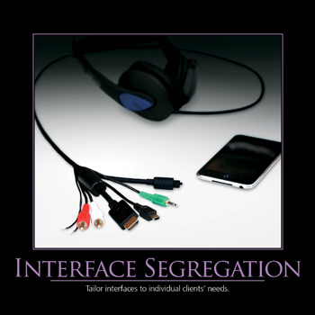

# Interface segregation principle (ISP)

> A client should never be forced to implement an interface that it doesn't use 
> or 
> clients shouldn't be forced to depend on methods they do not use.

*Source*: Robert C. Martin. Agile Principle Patterns and Practices [PPP].

> Build small, focused classes instead of big, giant classes.
> 
> If a class has a large interface - so a lot of methods - and you often inject the class and only use some of these methods - 
> consider splitting your class into smaller pieces.

*Source*: symfonycasts

Put more simply: Do not add additional functionality to an existing interface by adding new methods.
Instead, create a new interface and let your class implement multiple interfaces if needed.

 
 Make fine grained interfaces that are client specific.
 
Larger interfaces should be split into smaller ones. 
By doing so, we can ensure that implementing classes only need to be concerned about the methods that are of interest to them.

Why Should We Care about ISP?
1. Name -  Whether you have a class/interface that's too big then splitting it into smaller pieces 
   allows you to give each a more descriptive name that fits its purposes.
2.  If you notice that you often only call one or two methods from a class... 
    but not it's other public methods, that is a violation of ISP.
3. Keeps your dependencies lighter - split classes/interfaces.

tl;tr:
> when you have an interface with a method that not all of its classes need... 
> or if you have a class where you routinely use only some of its public methods...
> it may be time to **split it into smaller pieces**.
> 
> Or, more simply, you can remember to not build giant classes.

