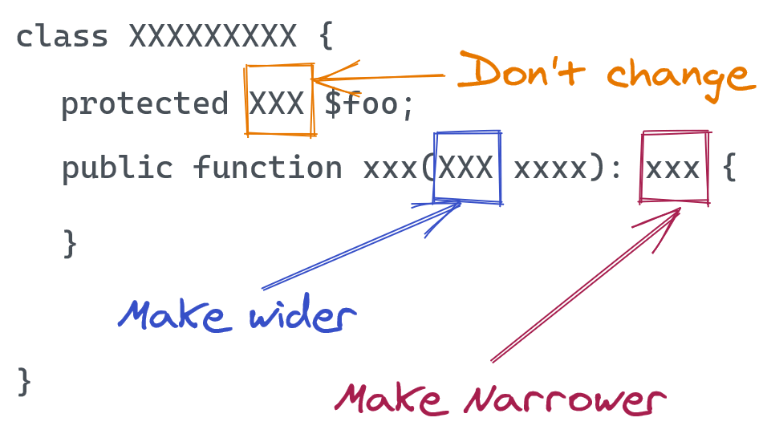

# Liskov substitution principle (LSP)

> Subtypes must be substitutable for their base types.
>
> Derived classes must be substitutable for their base classes.

*Source*: Robert C. Martin. Agile Principle Patterns and Practices [PPP].

 > Let q(x) be a property provable about objects of x of type T. 
 > Then q(y) should be provable for objects y of type S where S is a subtype of T.

*Source*:  Barbara Liskov

> You should be able to substitute a class for a sub-class without breaking your app or needing to change any code.
>
> In other words, a class should behave in a way that most users expect: it should behave like its parent class or interface intended.
> 
> If a class extends a base class or implements an interface, make your class behave like it is supposed to.

*Source*: symfonycast

> The principle of least surprise, applied to classes that have a parent class or implement an interface.

*Source*: Dan North


Simply put, if class A is a subtype of class B, 
then we should be able to replace B with A without disrupting the behavior of our program.

or Derived classes must be substitutable for their base classes.


LSP is closely related to the Single responsibility principle and Interface Segregation Principle.

If a class has more functionality than subclass might not support some of the functionality and does violate LSP.

The 4 Aspects that (Mostly) Define Liskov:
1. you cannot change the type of an overridden property *
2. you can't narrow the type hint of an argument * but you can make them less specific (make wider) -e.g. `DateTimeInterface`
3. you can't widen the return type of a method * but you can be more specific
4. follow your parent type(class/interface)'s rules on when to throw exceptions 

[*] The first 3 rule are impossible to violate in PHP (it throws syntax errors).


 !


## Example
```php
class Rectangle {
    protected $width;
    protected $height;

    public function setWidth($width) {
        $this->width = $width;
    }

    public function setHeight($height) {
        $this->height = $height;
    }

    public function getArea() {
        return $this->width * $this->height;
    }
}

class Square extends Rectangle {
    public function setWidth($width) {
        $this->width = $width;
        $this->height = $width;
    }

    public function setHeight($height) {
        $this->width = $height;
        $this->height = $height;
    }
}
```
While a square is a special case of a rectangle, this implementation **violates** the Liskov Substitution Principle.

The issue arises because the Square class overrides the `setWidth`() and `setHeight`() methods, making them behave differently from the base class.

In the base class, setting the width and height independently is allowed, but in the derived class, changing one dimension automatically changes the other to keep the square's property intact.

This violates the Liskov Substitution Principle because client code relying on the base class behavior may encounter unexpected results when using the derived class.


