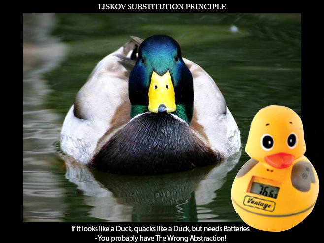

# Liskov substitution principle (LSP)

> Subtypes must be substitutable for their base types.
>
> Derived classes must be substitutable for their base classes.

*Source*: Robert C. Martin. Agile Principle Patterns and Practices [PPP].

 > Let q(x) be a property provable about objects of x of type T. 
 > Then q(y) should be provable for objects y of type S where S is a subtype of T.

*Source*:  Barbara Liskov

or Derived classes must be substitutable for their base classes.

LSP is closely related to the Single responsibility principle and Interface Segregation Principle.

If a class has more functionality than subclass might not support some of the functionality and does violate LSP.

