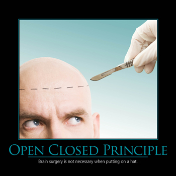

# Open Closed Principle (OCP)
> Software entities (classes, modules, functions, etc.) should be open for extension but closed for modification.

*Source*: Robert C. Martin. Agile Principle Patterns and Practices [PPP] from Meyer97.

OCP advises us to refactor the system so that further changes to dependent modules will not cause more modifications.

 Modules that conform to OCP have two primary *attributes*: 
  1. They are **open for extension** - This means that the behavior of the module can be extended.
  2. They are **closed for modification** - Extending the behavior of a module does not result in changes to the source

You should be able to extend a classes behavior, without modifying it.

Real example: an open source library (in /vendor folder).

> How is it possible that the behaviors of a module can be modified without changing its source code?
  Without changing the module, how can we change what a module does?
  The answer is **abstraction**.

> The primary mechanisms behind the Open/Closed Principle are *abstraction* and *polymorphism*.
> One of the key mechanisms that supports abstraction and  polymorphism is **inheritance**. 
> It is by using inheritance that we can create `derived classes` that implement abstract methods in base classes.

 
