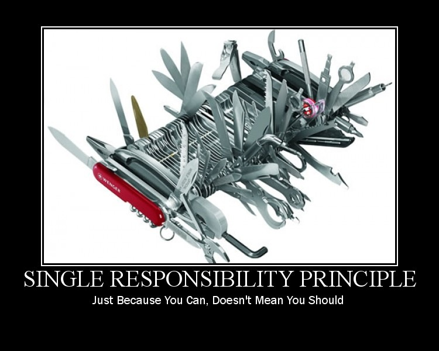

# The Single-Responsibility Principle (SRP)

> A class should have (one, and) **only one reason to change**.

> In the context of the SRP, we define a *responsibility* to be a *reason for change*.

*Source*: Robert C. Martin. Agile Principle Patterns and Practices [PPP]. 

“Do one thing and do it well”.

The Single-Responsibility Principle [SRP] is one of the simplest of the principles but one of the most difficult to get right.

Benefits: 
 - The class is easier to understand (does 1 thing)
 - The class is easier to maintain
 - The class is more reusable

The key benefit of this principle is that it reduces coupling between the individual component of the software and Code.

